### [<span style="font-family:Arial">CSCI 127 &nbsp; Introduction to Computer Science</span>](../127_2018_summer.html)  
<span style="line-height:0.1; font-family:Arial; font-size:21.8px">Hunter College &nbsp; City University of New York</span> 

---  

#### THE 2 HOUR FINAL EXAM WILL TAKE PLACE ON WEDNESDAY JULY 11 AT 1:30PM
#### Please make appropriate arrangements!  
  
---  
  
**LAB AND TUTOR HOURS:**  

**There is a dedicated computer laboratory for this course at HUNTER NORTH 1001E.**  
**It is the same lab where you have your recitation sessions!**   

**It is staffed with tutors, who are there to help you!** 

**MONDAYS and WEDNESDAYS from 9:30am to 6:00pm**  
**TUESDAYS and THURSDAYS from 3:00PM to 6:00PM**  

**Please take advantage of it!**  
  
---

### Programming Problem List  


#### General Notes

*   Every program should begin with a comment that includes your name and a brief description.
```python    
    #Name: Thomas Hunter
    #Date: May 30, 2018
    #This program prints: Hello, World!
    
    print("Hello, World!")
```    
*   You are encouraged to submit your assignments early. Below lists the last date on which each assignment will be accepted. Assignments must be **submitted before 9pm** on the date due.
*   **No credit will be given for an assignment submitted late.**
*   Before submitting an assignment you are free to ask for help in recitation, during tutoring and office hours. Please take advantage of this.
*   For more information on using [gradescope](http://www.gradescope.com), see the [first lab](lab1.html).
*   While you are encouraged to work with others, **all work submitted must be your own.** As a rule of thumb, **you must do your own typing**. If it is not from the book or class webpage and you did not type it, it is plagiarism. For the first incident, your grade will be a 0 for the assignment (even for cases where you typed the program but others submitted it as their own). For the second incident of cheating or plagiarism, your grade will be a 0 for the homework component of the grade (30% of your overall grade). For the third incident, you will fail the class. We report all incidents to the Office of Student Affairs.
*   Learning programming is like learning a foreign language: you will learn more (with less work) if you practice every day. Some of the programs below are easy; some will take more time. Set aside a block of time every day to work on programming. If you complete the program for that day, go on to the next with your remaining time.
    

* * *

Submit the following programs via [Gradescope:](http://gradescope.com)

* * *

01.  **Due Date: 7 June** **Think CS: [Chapters 1](https://interactivepython.org/runestone/static/thinkcspy/GeneralIntro/toctree.html) & [2](https://interactivepython.org/runestone/static/thinkcspy/SimplePythonData/toctree.html)**  

        Write a program that prints "Hello, World!" to the screen.

        _Hint: See [Lab 1](lab_01.html)._

02.  **Due Date: 7 June** **Think CS: [Chapters 2](https://interactivepython.org/runestone/static/thinkcspy/SimplePythonData/toctree.html) & [4](https://interactivepython.org/runestone/static/thinkcspy/PythonTurtle/toctree.html)**  
    
        Write a program that draws an octagon (8-sided polygon).  

        _Note: Choose a name for your file that is **not** turtle.py. When executing the "import turtle" statement, the computer first looks in the folder where the file is saved for the turtle module and then in the libraries (and other places on the path). So, it thinks the module is itself, causing all kinds of errors. To avoid this, name your program something like "myTurtle.py" or "program2.py"._

        _Hint: See [Lab 1](lab_01.html)._
    
03.  **Due Date: 7 June** **Think CS: [Chapters 2](https://interactivepython.org/runestone/static/thinkcspy/SimplePythonData/toctree.html) & [4](https://interactivepython.org/runestone/static/thinkcspy/PythonTurtle/toctree.html)**  
    
        Write a program that implements the [pseudocode](http://en.wikipedia.org/wiki/Pseudocode) ("informal high-level description of the operating principle of a computer program or other algorithm") below:

            Repeat 45 times:
                Walk forward 100 steps
                Turn right 92 degrees
                Walk forward 10 steps
                Turn right 92 degrees

        Your output should look similar to:  
        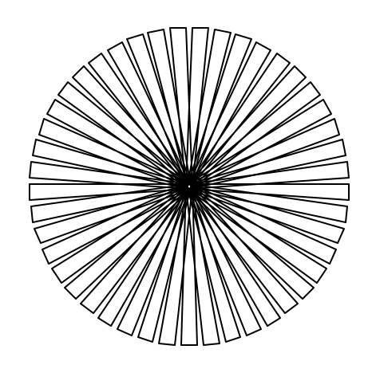  
  
04.  **Due Date: 7 June** **Think CS: [Chapters 2](https://interactivepython.org/runestone/static/thinkcspy/SimplePythonData/toctree.html) & [4](https://interactivepython.org/runestone/static/thinkcspy/PythonTurtle/toctree.html)**  

        Write a program that will print the Hunter College motto ("Mihi cura futuri" which translates to: "The care of the future is mine") 15 times.

        The output of your program should be:

            Mihi cura futuri
            Mihi cura futuri
            Mihi cura futuri
            Mihi cura futuri
            Mihi cura futuri
            Mihi cura futuri
            Mihi cura futuri
            Mihi cura futuri
            Mihi cura futuri
            Mihi cura futuri
            Mihi cura futuri
            Mihi cura futuri
            Mihi cura futuri
            Mihi cura futuri
            Mihi cura futuri
    
05.  **Due Date: 7 June** **Think CS: [Chapters 2](https://interactivepython.org/runestone/static/thinkcspy/SimplePythonData/toctree.html) & [4](https://interactivepython.org/runestone/static/thinkcspy/PythonTurtle/toctree.html)**  
    
        Write a program that draws a purple decagon (10-sided polygon) with turtle stamped at each corner.
    
        Your output should look similar to:  
        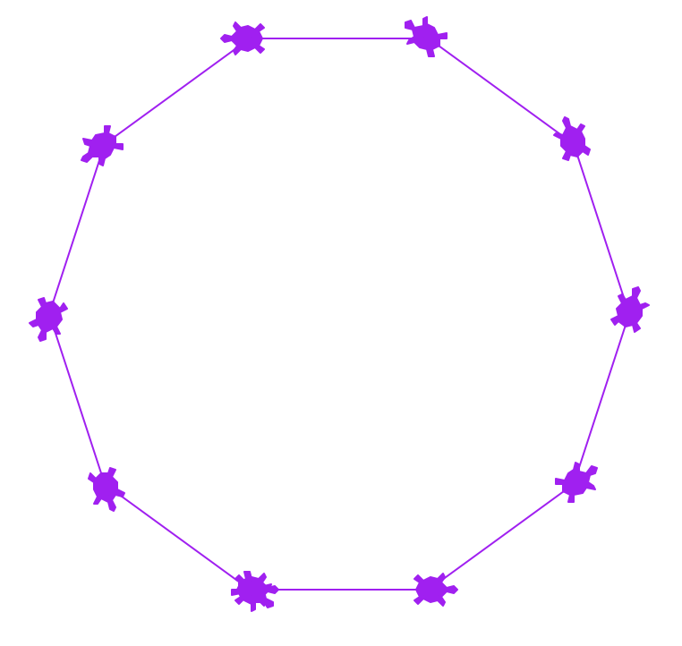
    
        _Hint: See Lecture 1._  

06.  **Due Date: 7 June** **Think CS: [Chapters 2](https://interactivepython.org/runestone/static/thinkcspy/SimplePythonData/toctree.html) & [4](https://interactivepython.org/runestone/static/thinkcspy/PythonTurtle/toctree.html)**  
    
        Write a Python program that prompts the user for a message, and then prints the message, the message in upper case letters, and the message in lower case letters.
    
        A sample run of your program should look like:
    
            Enter a message:  Mihi cura futuri
            Mihi cura futuri
            MIHI CURA FUTURI
            mihi cura futuri
    
        Another run:

            Enter a message:  I love Python!
            I love Python!
            I LOVE PYTHON!
            i love python!  

07.  **Due Date: 7 June** **Think CS: [Chapters 2](https://interactivepython.org/runestone/static/thinkcspy/SimplePythonData/toctree.html) & [9](http://interactivepython.org/runestone/static/thinkcspy/Strings/toctree.html)**  
    
        Write a program that prompts the user to enter a phrase and then prints out the ASCII code of each character in the phrase.
    
        A sample run of your program should look like:
    
            Enter a phrase:  I love Python!
            In ASCII: 
            73
            32
            108
            111
            118
            101
            32
            80
            121
            116
            104
            111
            110
            33
    
        _Hint: If c is a character, ord(c) returns its ASCII code. For example, if c is 'I', then ord(c) returns 73. See [Lab 2](lab_02.html)._  
    
08.  **Due Date: 7 June** **Think CS: [Chapters 2](https://interactivepython.org/runestone/static/thinkcspy/SimplePythonData/toctree.html) & [9](http://interactivepython.org/runestone/static/thinkcspy/Strings/toctree.html)**  
    
        Write a program that prompts the user for a DNA string, and then prints the length and GC-content (percent of the string that is C or G, written as a decimal).
    
        A sample run of your program should look like:

            Enter a DNA string:  ACGCCCGGGATG
            Length is 12
            GC-content is 0.75

        _Hint: See [Lab 2](lab_02.html)._  
    
09.  **Due Date: 7 June** **Think CS: [Chapters 2](https://interactivepython.org/runestone/static/thinkcspy/SimplePythonData/toctree.html) & [9](http://interactivepython.org/runestone/static/thinkcspy/Strings/toctree.html)**  
    
        Write a program that prompts the user to enter a word and then prints out the word with each letter **shifted right** by 2. That is, 'a' becomes 'c', 'b' becomes 'd', ... 'x' becomes 'z', and 'y' becomes 'a'.

        Assume that all inputted words are in lower case letters: 'a',...,'z'.

        A sample run of your program should look like:

            Enter a word: hello 
            Your word in code is: 
            jgnnq

        _Hint: See the example programs from Lecture 2._ . 
    
10.  **Due Date: 7 June** **Think CS: [Chapters 2](https://interactivepython.org/runestone/static/thinkcspy/SimplePythonData/toctree.html) & [9](http://interactivepython.org/runestone/static/thinkcspy/Strings/toctree.html)**  

        Write a program that implements the pseudocode below:

            For i = 10, 20, 30, ..., 100:
                     Walk forward i steps
                     Turn left 94 degrees

        Your output should look similar to:  
        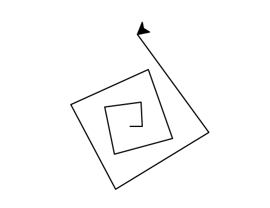

        _Hint: See [Lab 2](lab_02.html)._  
   
11.  **Due Date: 11 June** **Think CS: [Chapters 4](https://interactivepython.org/runestone/static/thinkcspy/PythonTurtle/toctree.html) & [9](http://interactivepython.org/runestone/static/thinkcspy/Strings/toctree.html)**  
    
        Write a program that asks the user for a message and then prints the message out, one character per line, in reverse order.

        A sample run of your program should look like:

            Enter a message:  I love Python!
            !
            n
            o
            h
            t
            y
            P

            e
            v
            o
            l

            I

        _Hint: See [Lab 2](lab_02.html) or Lecture 2 notes._  

12.  **Due Date: 11 June** **Think CS: [Chapters 2](https://interactivepython.org/runestone/static/thinkcspy/SimplePythonData/toctree.html) & [4](http://interactivepython.org/runestone/static/thinkcspy/PythonTurtle/toctree.html)**  
    
        Modify the program from [Lab 3](lab_03.html) to show the shades of green.

        Your output should look similar to:  
          
    
13.  **Due Date: 11 June** **Think CS: [Chapters 2](https://interactivepython.org/runestone/static/thinkcspy/SimplePythonData/toctree.html) & [4](http://interactivepython.org/runestone/static/thinkcspy/PythonTurtle/toctree.html)**  
    
        Write a program that asks the user for the hexcode of a color and then displays a turtle that color.

        A sample run of your program should look like:

            Enter a hex string:  #A922A9

        and the output should look similar to:  
        

        _Hint: See [Section 4.3](http://interactivepython.org/runestone/static/thinkcspy/PythonTurtle/InstancesAHerdofTurtles.html) for setting the background color and [Lab 3](lab_03.html) for colors._  
    
14.  **Due Date: 11 June** **Think CS: [Chapters 2](https://interactivepython.org/runestone/static/thinkcspy/SimplePythonData/toctree.html) & [4](https://interactivepython.org/runestone/static/thinkcspy/PythonTurtle/toctree.html)**  
    
        Write a program that asks the user for a name of an image .png file and the name of an output file. Your program should create a new image that has only the green channel of the original image.

        A sample run of your program should look like:

            Enter name of the input file:  csBridge.png
            Enter name of the output file:  greenH.png

        Sample input and resulting output files:

        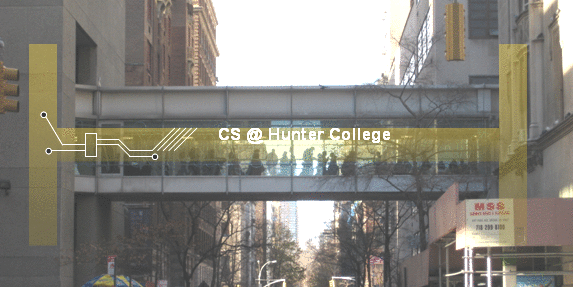 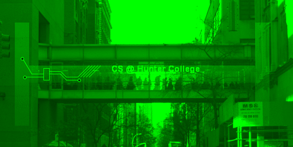

        Note: before submitting your program for grading, remove the commands that show the image (i.e. the ones that pop up the graphics window with the image). The program is graded on a server on the cloud and does not have a graphics window, so, the plt.show() commands will give an error. Instead, the files your program produces are compared pixel-by-pixel to the answer to check for correctness.  
    
15.  **Due Date: 11 June** **Think CS: [Chapters 2](https://interactivepython.org/runestone/static/thinkcspy/SimplePythonData/toctree.html) & [4](http://interactivepython.org/runestone/static/thinkcspy/PythonTurtle/toctree.html)**  
    
        Write a program that implements the pseudcode below. Your program should ask the user for a binary number and print out the corresponding decimal number.

        Ask user for input, and store in the string, binString.  
        
            Set decNum = 0.
            For each c in binString,
            Set n to be int(c)
            Double decNum and add n to it (decNum = 2 * decNum + n)
            Print decNum

        A sample run of the program:

            Enter binary number: 10
            Your number in decimal is 2

        And another sample run of the program:

            Enter binary number: 1111
            Your number in decimal is 15

        Note: here's a quick [review](https://www.mathsisfun.com/binary-number-system.html) of binary numbers.  
    
16.  **Due Date: 14 June** **Reading: Think CS: [Section 2.7](http://interactivepython.org/runestone/static/thinkcspy/SimplePythonData/OperatorsandOperands.html)**  

        Write a program that converts kilometers to miles. Your program should prompt the user for the number of kilometers and then print out the number of miles.

        A useful formula: _miles = 0.621371* kilometers_.

        See [Lab 4](lab_04.html) for designing Input-Process-Output programs.  
    
17.  **Due Date: 14 June** **Reading: Think CS: [Section 2.7](http://interactivepython.org/runestone/static/thinkcspy/SimplePythonData/OperatorsandOperands.html) & [4](http://interactivepython.org/runestone/static/thinkcspy/PythonTurtle/toctree.html)**  
    
        Write a program that implements the pseudocode below:

        1\.  Ask the user for the number of hours until the weekend.
        2\.  Print out the days until the weekend (days = hours // 24)
        3\.  Print out the leftover hours (leftover = hours % 24)

        A sample run of your program should look like:

            Enter number of hours:  27
            Days: 1
            Hours: 3

        and another sample run:

            Enter number of hours:  52
            Days: 2
            Hours: 4

        _Hint: See [Section 2.7](http://interactivepython.org/runestone/static/thinkcspy/SimplePythonData/OperatorsandOperands.html)._  
    
18.  **Due Date: 14 June** **Reading: Think CS: [Chapters 4](http://interactivepython.org/runestone/static/thinkcspy/PythonTurtle/toctree.html) & [7](http://interactivepython.org/runestone/static/thinkcspy/Selection/toctree.html)**  

        Write a program that asks the user for 5 whole (integer) numbers. For each number, turn the turtle left the degrees entered and then the turtle should move forward 100.

        A sample run of your program should look like:

            Enter a number: 270
            Enter a number: 100
            Enter a number: 190
            Enter a number: 200
            Enter a number: 80

        and the output should look similar to:  
          
    
19.  **Due Date: 14 June** **Reading: Think CS: [Chapters 4](http://interactivepython.org/runestone/static/thinkcspy/PythonTurtle/toctree.html) & [7](http://interactivepython.org/runestone/static/thinkcspy/Selection/toctree.html)**  
    
        Modify the flood map of NYC from [Lab 4](lab_04.html) to color the region of the map with elevation greater than 6 feet and less than or equal 20 feet above sea level the color grey (50% red, 50% green, and 50% blue).

        Your resulting map should look like:

        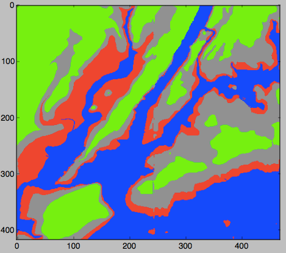

        and be saved to a file called floodMap.png.

        Note: before submitting your program for grading, remove the commands that show the image (i.e. the ones that pop up the graphics window with the image). The program is graded on a server on the cloud and does not have a graphics window, so, the plt.show() commands will give an error. Instead, the files your program produces are compared pixel-by-pixel to the answer to check for correctness.  
    
20.  **Due Date: 14 June** **Reading: [Think CS: Section 8.10](http://interactivepython.org/runestone/static/thinkcspy/MoreAboutIteration/2DimensionalIterationImageProcessing.html)**  
    
        Modify the map-mapking program from [Lab 4](lab_04.html) to create a map that outlines the coastline. Your program should create a new image, called coast.png with the pixels colored as follows:

        *   If the elevation is less than or equal to 0, color the pixel 50% blue (and 0% red and 0% green).
        *   If the elevation is exactly 1, color the pixel 75% red, 75% green, and 75% blue.
        *   Otherwise, the pixel should be colored 50% red, 50% green, and 50% blue.

        Your resulting map should look like:

        

        and be saved to a file called coast.png.

        Note: before submitting your program for grading, remove the commands that show the image (i.e. the ones that pop up the graphics window with the image). The program is graded on a server on the cloud and does not have a graphics window, so, the plt.show() commands will give an error. Instead, the files your program produces are compared pixel-by-pixel to the answer to check for correctness.  
    
21.  **Due Date: 14 June** **Reading: Think CS: [Chapter 7](http://interactivepython.org/runestone/static/thinkcspy/Selection/toctree.html)**  
    
        Write a program that asks the user for the name of a png file and print the number of pixels that are nearly white (the fraction of red, the fraction of green, and the fraction of blue are all above 0.75).

        For example, if your file was of the snow pack in the Sierra Nevada mountains in California in February 2014:

        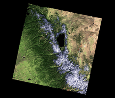

        then a sample run would be:

            Enter file name:  caDrought2014.png
            Snow count is 38010

        Note: for this program, you only need to compute the snow count. Showing the image will confuse the grading script, since it's only expecting the snow count.

        _Hint: See [Lab 5](lab_05.html)_.  
    
22.  **Due Date: 14 June** **Reading: [Burch's Logic & Circuits](http://www.toves.org/books/logic/)**  
    
        Write a logical epxression that is equivalent to the circuit that computes the majority of 3 inputs, called in1, in2, in3:

        *   If two or more of the inputs are True, then your expression should evaluate to True.
        *   Otherwise (two or more of the inputs are False), then your expression should evaluate to False.

        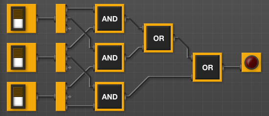

        Save your expression to a text file. See [Lab 5](lab5.html) for the format for submitting logical expressions to Gradescope.
    
23.  **Due Date: 14 June** **Reading: [Burch's Logic & Circuits](http://www.toves.org/books/logic/)**  
        Build a circuit that has the same behavior as a nor gate (i.e. for the same inputs, gives identical output) using only and, or, and not gates.

        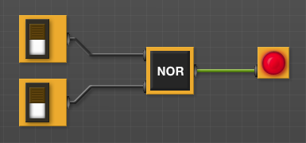

        Save your expression to a text file. See [Lab 5](lab5.html) for the format for submitting logical expressions to Gradescope.  
    
24.  **Due Date: 14 June** **Reading: Think CS: [Chapters 2](http://interactivepython.org/runestone/static/thinkcspy/SimplePythonData/toctree.html) & [4](http://interactivepython.org/runestone/static/thinkcspy/PythonTurtle/toctree.html)**  
    
        The program [turtleString.py](../f17/turtleString.py) takes a string as input and uses that string to control what the turtle draws on the screen (inspired by [code.org's graph paper programming](https://code.org/curriculum/course2/1/Teacher)). Currently, the program processes the following commands:

        *   'F': moves the turtle forward 50 steps
        *   'L': turns the turtle 90 degrees to the left
        *   'R': turns the turtle 90 degrees to the right
        *   '^': lifts the pen
        *   'v': lowers the pen

        For example, if the user enters the string "FLFLFLFL^FFFvFLFLFLFL", the turtle would move forward and then turn left. It repeats this 4 times, drawing a square. Next, it lifts the pen and move forward 3, puts the pen back down and draw another square.

        Modify this program to allow the user also to specify with the following symbols:

        *   'B': moves the turtle backwards 50 steps
        *   'S': makes the turtle stamp
        *   'l': turns the turle 45 degrees to the left
        *   'r': turns the turtle 45 degrees to the right
        *   'p': change the pen color to purple

        _Hint: See Lecture 4 notes._ . 
    
25.  **Due Date: 14 June** **Think CS: [Chapter 4](https://interactivepython.org/runestone/static/thinkcspy/PythonTurtle/toctree.html) & [Section 7.4](http://interactivepython.org/runestone/static/thinkcspy/Selection/ConditionalExecutionBinarySelection.html)**
    
        Write a program that uses the turtle package to implement the following pseudocode:

        1\.  Ask the user for a whole number.  
        2\.  If that number is even, your turtle should draw a blue line 
            towards the left hand side of the screen. 
        3\.  If that number is odd, your turtle should draw a red line 
            towards the right hand side of the screen.

        A sample run of your program should look like:

            Enter a whole number: 2

        and the output should look similar to:  
        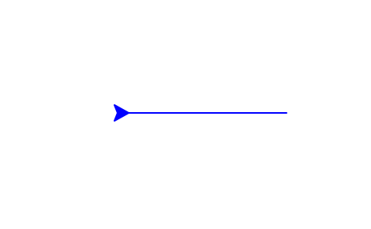

        Another run:

            Enter a whole number: -1

        and the output should look similar to:  
        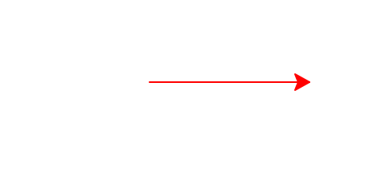  

        _Hint: See [Section 7.4](http://interactivepython.org/runestone/static/thinkcspy/Selection/ConditionalExecutionBinarySelection.html) of the Python textbook and Lecture 4 notes._  

      

26.  **Due Date: 18 June** **Reading: [Numpy tutorial (DataCamp)](https://www.datacamp.com/community/tutorials/python-numpy-tutorial)**  
    
        Modify the program from [Lab 6](lab6.html) that displays the [NYC historical population data](nycHistPop.csv). Your program should ask the user for the borough, an name for the output file, and then display the fraction of the population that has lived in that borough, over time.

        A sample run of the program:

            Enter borough name:  Queens
            Enter output file name:  qFraction.png

        The file qFraction.png:

        

        Note: before submitting your program for grading, remove the commands that show the image (i.e. the ones that pop up the graphics window with the image). The program is graded on a server on the cloud and does not have a graphics window, so, the plt.show() commands will give an error. Instead, the files your program produces are compared pixel-by-pixel to the answer to check for correctness.
    
27.  **Due Date: 18 June** **Reading: [10-mins to Pandas](https://pandas.pydata.org/pandas-docs/stable/10min.html), [DataCamp Pandas](https://www.datacamp.com/community/tutorials/pandas-tutorial-dataframe-python#gs.hnyRaik)**  
    
        Write a program that computes the average and maximum population over time for a borough (entered by the user). Your program should assume that the NYC historical population data file, [nycHistPop.csv](nycHistPop.csv) is in the same directory.

            A sample run of your program:

            Enter borough: Staten Island
            Average population:  139814.23076923078
            Maximum population:  474558

        and another run:

            Enter borough: Brooklyn
            Average population:  1252437.5384615385
            Maximum population:  2738175

        _Hint: See [Lab 6](lab_06.html)_.
    
28.  **Due Date: 18 June** **Reading: Think CS [Chapter 7](http://interactivepython.org/runestone/static/thinkcspy/Selection/toctree.html)**  
    
        Write a program that asks the user for the hour of the day (in 24 hour time), and prints

        *   "Good Morning" if it is strictly before 12,
        *   "Good Afternoon" if it is 12 or greater, but strictly before 17, and
        *   "Good Evening" otherwise.

        A sample run:

            Enter hour (in 24 hour time):  11
            Good Morning

        Another sample run:

            Enter hour (in 24 hour time):  20
            Good Evening

        And another run:

            Enter hour (in 24 hour time):  15
            Good Afternoon
    
29.  **Due Date: 18 June** **Reading: [Ubuntu Terminal Reference Sheet](https://help.ubuntu.com/community/UsingTheTerminal)**  
    
        Write an Unix shell script that prints Hello, World to the screen.

        Submit a single text file containing your shell commands. See [Lab 6](lab_06.html).
    
30.  **Due Date: 18 June** **Reading: [Burch's Logic & Circuits](http://www.toves.org/books/logic/)**  
    
        Logical gates can be used to do arithmetic on binary numbers. For example, we can write a logical circuit whose output is one more than the inputted number. Our inputs are in1 and in2 and the outputs are stored in `out1`, `out2`, and `out3`.

        [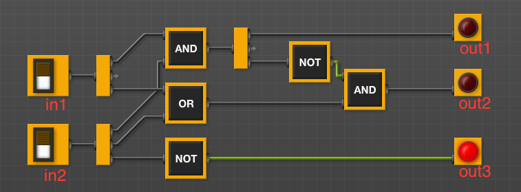  
        (click to launch new window with circuit)](http://www.neuroproductions.be/logic-lab/index.php?id=80507)

        Here is a table of the inputs and outputs:  
  
            | | Inputs | || | Outputs 
            Decimal<br/>Number | in1 | in2 || Decimal<br/>Number | out1 | out2 | out3
            ---|---|---||---|---|---|--- 
            0 | 0 | 0 || 1 | 0 | 0 | 1 
            1 | 0 | 1 || 2 | 0 | 1 | 0 
            2 | 1 | 0 || 3 | 0 | 1 | 1 
            3 | 1 | 1 || 4 | 1 | 0 | 0 
  
        Submit a text file with each of the outputs on a separate line:

            #Name:  YourNameHere
            #Date:  April 2017
            #Logical expressions for a 4-bit incrementer

            out1 = ...
            out2 = ...
            out3 = ...

        Where `...` is replaced by your logical expression (see [Lab 5](lab5.html)).

    
31.  **Due Date: 21 June** **Reading: [10-mins to Pandas](https://pandas.pydata.org/pandas-docs/stable/10min.html), [DataCamp Pandas](https://www.datacamp.com/community/tutorials/pandas-tutorial-dataframe-python#gs.hnyRaik)**  
    
        Modify the program from [Lab 7](lab7.html) to:

        *   asks the user to specify the input file,
        *   asks the user to specify the output file,
        *   makes a plot of the fraction of the total population that are children over time from the data in input file, and
        *   stores the plot in the output file the user specified.

        A sample run of the program:

            Enter name of input file:  DHS\_2015\_2016.csv  
            Enter name of output file:  dhsPlot.png  

        which produces an output:

        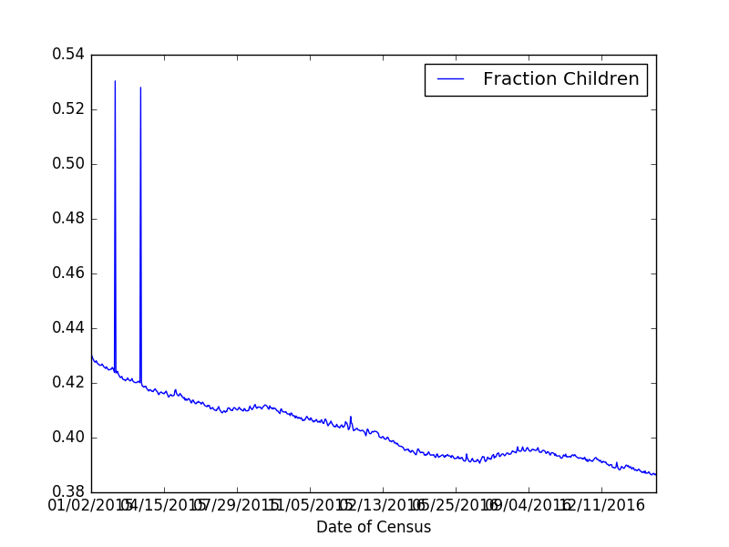

        Note: The grading script is expecting that the label (i.e. name of your new column) is `"Fraction Children"`.
    
32.  **Due Date: 21 June** **Reading: Think CS [Section 6.7](http://interactivepython.org/runestone/static/thinkcspy/Functions/mainfunction.html)**  

        Write a program, using a function `main()` that prints `Hello, World!` to the screen. See [Lab 7](lab_07.html).
    
33.  **Due Date: 21 June** **Reading: Think CS [Chapter 9](http://interactivepython.org/runestone/static/thinkcspy/Strings/toctree.html)**  
    
        Write a program that asks the user for a list of nouns (separated by spaces) and approximates the fraction that are plural by counting the fraction that end in `s`. Your program should output the total number of words and the fraction that end in `s`. You may assume that words are separated by spaces (and ignore the possibility of tabs and punctuation between words.)

        A sample run of the program:

            Enter nouns: apple bananas cantalopes durian 
            Number of words:  4
            Fraction of your list that is plural is 0.5

        And another sample run of the program:

            Enter nouns: hats gloves coats glasses scarves
            Number of words:  5
            Fraction of your list that is plural is 1.0 

        _Hint: Break this problem into pieces:_

        _*   First, count the number of words in the string the user entered (hint: count the number of spaces). Print out the number of words. Make sure this works before going onto the next part.
        *   Next, ignoring the last word (which is a special case and can be dealt with separately), count the number of words ending in `s` (hint: count the number of `s`). Test that this part works before going on to the next step.
        *   Last, check the last word to see if it ends in `s`-- since it's the last word, the `s` will always occur at the same index in the string._

        _Implement (and test!) each part and then go on to the next._  
    
34.  **Due Date: 21 Juneh** **Reading: [Burch's Logic & Circuits](http://www.toves.org/books/logic/)**  

        Write a logical expression that takes a single input, in1, and **always** returns True. Your expression must only use in1 and the logical operators, and, or, and not

        See [Lab 5](lab_05.html) for the format for submitting logical expressions to Gradescope.

        _Hint: Think about the circuit below:_

        
    
35.  **Due Date: 21 June**
    
        Write a program that asks the user for the name of an image, the name of an output file. Your program should then save the lower left quarter of the image to the output file specified by the user.

        A sample run of your program should look like:

            Enter image file name: hunterLogo.png
            Enter output file: logoLL.png

        which would have as input and output:

         

        _Hint: See sample programs from Lectures 4 and 6._

        Note: before submitting your program for grading, remove any commands that show the image (i.e. the ones that pop up the graphics window with the image). The program is graded on a server on the cloud and does not have a graphics window, so, the `plt.show()` commands will give an error. Instead, the files your program produces are compared pixel-by-pixel to the answer to check for correctness.
    
36.  **Due Date: 11 April** **Reading: [10-mins to Pandas](https://pandas.pydata.org/pandas-docs/stable/10min.html), [DataCamp Pandas](https://www.datacamp.com/community/tutorials/pandas-tutorial-dataframe-python#gs.hnyRaik)**  

        Modify the parking ticket program from [Lab 8](lab_08.html) to do the following:

        *   Ask the user for the name of the input file.
        *   Ask the user for the attribute (column header) to search by.

        A sample run:

            Enter file name:  Parking\_Violations\_Jan_2016.csv
            Enter attribute:  Vehicle Color
            The 10 worst offenders are:
            WHITE    2801
            WH       2695
            GY       1420
            BK       1153
            BLACK    1054
            BROWN     727
            BL        656
            GREY      574
            SILVE     450
            BLUE      412
            Name: Vehicle Color, dtype: int64

        And another run:

            Enter file name:  Parking\_Violations\_Jan_2016.csv
            Enter attribute:  Vehicle Year
            The 10 worst offenders are:
            0       3927
            2015    1265
            2014    1143
            2013    1105
            2012     772
            2011     666
            2007     643
            2008     559
            2010     509
            2006     499
            Name: Vehicle Year, dtype: int64
    
37.  **Due Date: 12 April** **Reading: [Github Guide](https://guides.github.com/activities/hello-world/)**  
    
        In [Lab 8](lab_08.html), you created a github account. Submit a text file with the name of your account. The grading script is expecting a file with the format:
  
            #Name:  Your name 
            #Date:  April 2017
            #Account name for my github account

            AccountNameGoesHere  
  
***Note: it takes a few minutes for a newly created github account to be visible. If you submit to gradescope and get a message that the account doesn't exist, wait a few minutes and try again.**  
    
38.  **Due Date: 13 April** **Reading: Think CS: [Chapter 6](http://interactivepython.org/runestone/static/thinkcspy/Functions/toctree.html)**  
    
        Fill in the missing function, monthString(), in the program, months.py (available at: [https://github.com/stjohn/csci127](https://github.com/stjohn/csci127)). The function should take number between 1 and 12 as a parameter and returns the corresponding month as a string. For example, if the parameter is 1, your function should return `"January"`. If the parameter is `2`, your function should return out `"February"`, etc.

        Note: The grading scripts are expecting that your function is called monthString(). You need to use that name, since instead of running the entire program, the scripts are "unit testing" the function-- that is, calling that function, in isolation, with differrent inputs to verify that it performs correctly.

        _Hint: See notes from Lecture 7 and [Lab 8](lab_08.html)._
    
39.  **Due Date: 16 April** **Reading: [10-mins to Pandas](https://pandas.pydata.org/pandas-docs/stable/10min.html), [DataCamp Pandas](https://www.datacamp.com/community/tutorials/pandas-tutorial-dataframe-python#gs.hnyRaik)**  
    
        Write a program that asks the user for a CSV of collision data (see note below about obtaining reported collisions from NYC OpenData). Your program should then list the top three contributing factors for the primary vehichle of collisions `"CONTRIBUTING FACTOR VEHICLE 1"` in the file.

        A sample run:

            Enter CSV file name:  collisionsNewYears2016.csv
            Top three contributing factors for collisions:
            Driver Inattention/Distraction    136
            Unspecified                       119
            Following Too Closely              37
            Name: CONTRIBUTING FACTOR VEHICLE 1, dtype: int64

        This assignment uses collision data collected and made publicly by [New York City Open Data](https://nycopendata.socrata.com), and can be found at:

        > [https://data.cityofnewyork.us/Public-Safety/NYPD-Motor-Vehicle-Collisions/h9gi-nx95](https://data.cityofnewyork.us/Public-Safety/NYPD-Motor-Vehicle-Collisions/h9gi-nx95).

        Since the files are quite large, use the "Filter" option and choose your birthday in 2016 and "Export" (in CSV format) all collisions for that day. We will use this data set for future programs, so, instead of downloading the test files multiple times, save a copy for future use.

        _Hint: See [Lab 8](lab_08.html) for accessing and analyzing structured data._
    
40.  **Due Date: 17 April** **Reading: Think CS [Chapter 6](http://interactivepython.org/runestone/static/thinkcspy/Functions/toctree.html)**
    
        Write two functions, `triangle()` and `nestedTriangle()`. Both functions take two parameters: a turtle and an edge length. The pseudocode for triangle() is:

            triangle(t, length):
            1.  If length > 10:
            2.     Repeat 3 times:
            3.         Move t, the turtle, forward length steps.
            4.         Turn t left 120 degrees.
            5.     Call triangle with t and length/2.

        The pseudocode for nestedTriangle() is very similar:

            nestedTriangle(t, length):
            1.  If length > 10:
            2.     Repeat 3 times:
            3.         Move t, the turtle, forward length steps.
            4.         Turn t left 120 degrees.
            5.         Call nestedTriangle with t and length/2.

        A template program, nestingTrianges.py, is available on the [CSci 127 repo on github](https://github.com/stjohn/csci127). The grading script does not run the whole program, but instead tests your function separately ('unit tests') to determine correctness. As such, the function names must match exactly (else, the scripts cannot find it). Make sure to use the function names from the github program -- it is expecting `triangle()` and `nestedTriangle()`.

        A sample run:

            Enter edge length:  160

        which would produce:
        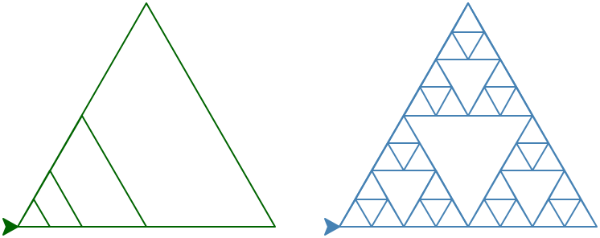 
        
  
  
_(This file was last modified on 12 June 2018.)_
