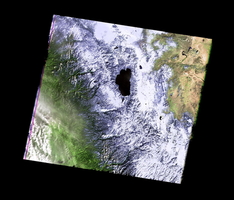
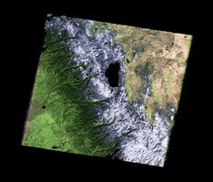
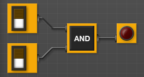
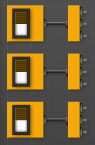
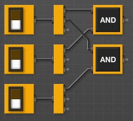
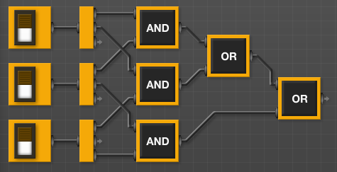

### [CSCI 127 &nbsp; Introduction to Computer Science](../127_2018_summer.html)  
Hunter College &nbsp; City University of New York 

---  
  	
LAB 5
---

Today's lab will focus on logical expressions and circuits.

Software tools needed: web browser and Python IDLE programming environment with numpy and matplotlib packages installed.

### In-class Quiz

During lab, there is a [quiz](quizzes.html). The password to access the quiz will be given during lab. To complete the quiz, log on to Blackboard (see [Lab 1](lab_01.html) for details on using Blackboard).

### Using Python, Gradescope, and Blackboard

See [Lab 1](lab_01.html) for details on using Python, Gradescope, and Blackboard.

### Logical Expressions

Last week, we introduced decisions (if-statements). These relied on the "test" which was an expression that evaluated to true or false.

We can build up more complicated logical expressions using built-in operators, and, or, and not. A standard way to summaries these operators is with **truth tables**. A truth table lists all the possible inputs and gives the output for each combination.

For example, here is the truth table for the **AND** operator:

 in1 | in2 | in1 AND in2 
 :---:|:---:|:---: 
 True | True | True 
 False | True | False 
 True | False | False 
 False | False | False 

It lists all the possible combinations of values for the inputs, in1 and in2 and what and would give as output. For example, if in1 is True and in2 is False, the value of in1 and in2 can be read off the last column of the third line of the truth table as False.

Similarly here is the truth table for **OR**:

 in1 | in2 | in1 OR in2 
 :---:|:---:|:---: 
 True | True | True 
 False | True | True 
 True | False | True 
 False | False | False 

For example, if in1 is True and in2 is False, the value of in1 or in2 can be read off the last column of the third line of the truth table as True.

The not operator changes the input from false to true, or true to false. That is, not True is false and not False is true. We can write this in the table format above:

 in1 | NOT in1 
 :---:|:---:
 True | False 
 False | True 
   
These logical operators are useful building complex tests for our if-statements (as well as other control structures that will be introduced later).

#### Snow Pack in California

As an example of logical expressions, we will use them to estimate the snow pack level in California over the last drought using satellite imagery.

Landsat Satellite Program is a joint program of USGS and NASA that has provided continuous images of the earth since 1972. The data is publicly available through the USGS-EROS site and has been invaluable in mapping changes in the earth. Today, we will use data images from the USGS remote sensing gallery:

> [http://remotesensing.usgs.gov/gallery/](http://remotesensing.usgs.gov/gallery/)

The [snow pack in the Sierra Nevada mountains](https://earthobservatory.nasa.gov/IOTD/view.php?id=89738) provide almost a third of the water used by California. As a first estimate of snow pack, the number of pixels that are (nearly) white are counted. How much change has their been in the Sierra Nevada snowpack during the past drought in California? Here are images from before and during the worst years of the drought:

 |  |   
[February 2011](CaliforniaDrought_02232011_md.png) | [February 2013](CaliforniaDrought_02122013_md.png) | [February 2014](CaliforniaDrought_02232014_md.png)  

How much snow is there? We will use the number of pixels that are nearly white as an estimate of the snow. We can add in a new variable, countSnow to keep track of each time a pixel is nearly white. Here's an outline of our program:

	1.  Import the libraries to manipulate and display arrays.
	2.  Read in the California image and store in the variable, ca
	3.  Create a new variable, countSnow, to keep track of the number of pixels that are nearly white.
	4.  For each element in elevations,
	5.          If the pixel is nearly white
	6.                  countSnow = countSnow + 1
	7.  Print out countSnow.

When is a pixel white? It's when the red, green, and blue values are close to 100%. In code, we would have:

	t = 0.75    #Threshold for almost white-- can adjust between 0.0 and 1.0 

	...
	for i in range(ca.shape[0]):
	    for j in range(ca.shape[1]):
		if (ca[i,j,0] > t) and (ca[i,j,1] > t) and (ca[i,j,2] > t):
		     countSnow = countSnow + 1

Let's translate that into Python. Open up a new IDLE window and copy over the outline. Using the image programs from [last lab](lab_04.html) as a template, fill in as much as possible before looking at the program below:

	#Name:  CSci 127 Teaching Staff
	#Date:  Fall 2017
	#This program loads an image, counts the number of pixels that are nearly white as an estimate for snow pack.

	#Import the packages for images and arrays:
	import matplotlib.pyplot as plt  
	import numpy as np

	ca = plt.imread('CaliforniaDrought\_02232011\_md.png')   #Read in image
	countSnow = 0            #Number of pixels that are almost white
	t = 0.75                 #Threshold for almost white-- can adjust between 0.0 and 1.0

	#For every pixel:
	for i in range(ca.shape[0]):
	     for j in range(ca.shape[1]):
		  #Check if red, green, and blue are > t:
		  if (ca[i,j,0] > t) and (ca[i,j,1] > t) and (ca[i,j,2] > t):
		       countSnow = countSnow + 1

	print("Snow count is", countSnow)

This program assumes that you have downloaded and saved [CaliforniaDrought\_02232011\_md.png](CaliforniaDrought_02232011_md.png) to the same directory as your program.

How can you modify your program to let the user specify the input file? See [Programming Problem List](assignments.html).

### Logical Circuits

The logical expressions above are useful not only in designing decisions and selecting data in Python, but the same concept underlies much of the hardware of computers. The and, or, and not can all be simulated in hardware via [logic gates](https://en.wikipedia.org/wiki/Logic_gate). These gates take inputs (usually 0 or 1) and output a value, based on the logical operator it is simulating.

Here is a simulator for circuits. Let's see an and gate in action:

[  
(click to launch new window with circuit builder)](http://www.neuroproductions.be/logic-lab/index.php?id=78962)

*   Try toggling (clicking on) the switches on the left of the canvas. What happens?
*   When does the light turn red?
*   When does the light turn off?

Try making a circuit with an or gate:

*   From the left hand menu, pull over two switches (the little boxes with a toggle switch on them) to the canvas..
*   Scroll down to the next menu, and choose "OR" from the Logic ports and drag it over to canvas.
*   Each switch has an output (little circle with an outward pointing arrow). Click on the output of the first switch and link to the inward pointing arrow of the OR gate.
*   Repeat with the other switch to connect it to the other input of the AND gate.
*   Scroll down to the bottom of the left hand menu, and choose the output with the single red circle.
*   Connect the output of the OR to the input of the red output gate.
*   Toggle (click) on the switches. What happens to the red output light?
    
    What is different between the behavior of the or and and gates?
    

#### Majority of 3 Inputs

Now, let's build a circuit, or collection of gates, that takes majority of 3 inputs, called `in1`, `in2`, `in3`:

*   If two or more of the inputs are True, then your expression should evaluate to `True`.
*   Otherwise (two or more of the inputs are False), then your expression should evaluate to `False`.

[Here's a window](http://www.neuroproductions.be/logic-lab/) for building your circuit (if running from home, you may need to allow the browser to run flash-- what the circuit app uses for graphics). Directions (with images) are below:

Build your circuit as you read the instructions below:

1.  The question asks for 3 inputs -- let's use switches since those are easy to test out whether it works.
2.  We are going to need to check if any pair of inputs is `True`. An easy way to do this is to check that:
    
    *   `in1` and `in2` are both `True`, or
    *   `in1` and `in3` are both `True`, or
    *   `in3` and `in3` are both `True`
    
    An easy way to do this is to "split the signal" of each input, so, we can use it in multiple places.  
    Go to the "Extras" menu (may need to scroll down) and pick up 3 splitters (has 1 input, 3 outputs) and hook one up to each of the inputs:  
    .
3.  We'll build up our circuits in stages:
    
    *   To check that in1 and in2 are both true, hook both of them up to an and gate (in the Logic ports menu).
    *   To check that in1 and in3 are both true, hook both of them up to an and gate (in the Logic ports menu).
    *   To check that in2 and in3 are both true, hook both of them up to an and gate (in the Logic ports menu).
    
        
    You can check the wiring by toggling any two switches-- when you toggle the first and the second, the wires going to the first and gate should be highlighted in green. Check the first and the third, and second and third as well, to make sure all is connected right.
4.  We have each of the three things done in our to-do list above. The list is connected by "or", so, we need to do the same with our outputs:  
     .
5.  And lastly, let's add an output light that will glow when true:  
    

Test the circuit you just built:

*   if two or more switches are on, is the output light on?
*   if two or more switches are off, is the output light off?

Adjust your circuit until it only lights up when two switches are on.

#### Translating Logical Circuits to Logical Expressions

How do we represent this as a logical expression? Let's work backwards from the output light:  

Our last gate is an or, so we will write down an or

	(lotsOfStuff1) or (lotsOfStuff2)

We'll use parenthesis to keep things neat. Now, let's look at the left hand side (lotsOfStuff1). It also has an or, so we can write it down:

	((lotsOfStuff3) or (lotsOfStuff4)) or (lotsOfStuff2)

Let's keep refining our expressions (lotsOfStuff3) has an and at the top, so, we will replace it with:

	(((lotsOfStuff5) and (lotsOfStuff6)) or (lotsOfStuff4)) or (lotsOfStuff2)

(lotsOfStuff5) is just a wire back to the first input, so, we can write that instead:

	((in1 and (lotsOfStuff6)) or (lotsOfStuff4)) or (lotsOfStuff2)

and similarly, (lotsOfStuff6) is just a wire back to the second input, so, we can write that instead:

	((in1 and in2) or (lotsOfStuff4)) or (lotsOfStuff2)

That looks better! If look at lotsOfStuff4, we see an and gate with wires back to the first and third inputs:

	((in1 and in2) or (in1 and in3)) or (lotsOfStuff2)

Similarly, we can replace lotsOfStuff2 with:

	((in1 and in2) or (in1 and in3)) or (in2 and in3)

Save this line to a text file (you can use any text editor, just make sure to save it as plain text, with no formatting):

#Name: Your name here
#Date: 16 October 2017
#Program #23:  Computes the majority of 3 inputs

out = ((in1 and in2) or (in1 and in3)) or (in2 and in3)

(your expression, preceded by out = ). For the logical expressions homework, you submit just a text file with the logical expressions. The grading script evaluates the expression, testing it with different inputs. See the [Programming Problem List](ps.html).

#### More Exotic Gates

In addition the and, or, and not gates, there are several other standard gates. For each, we can build a circuit using just and, or, and not gates that gives the same output.

What does a nor gate do?

[Toggle the inputs](http://www.neuroproductions.be/logic-lab/index.php?id=85202) to figure out what the gate does.

Now, build a circuit that has the same behavior as a nor gate (i.e. for the same inputs, both give identical output) using only and, or, and not gates.

When you have the answer, label your inputs in1 and in2, save the answer in a file:

#Name: Your name here
#Date: 16 October 2017
#Program #23:  Computes NOR of two inputs, using only AND, OR, and NOT gates

out = ...

(where ... is replaced by your answer). See the [Programming Problem List](ps.html).

### More on the Command Line Interface: Absolute Paths

[Last lab](lab4.html), we introduced relative paths for navigating the directories via the shell. Relative paths (e.g. cd ../) used the current location when executing. We can also use _absolute paths_ that are independent of your location. For example,

    cd /usr/bin
    pwd
    ls

will change your working directory to one of the machine's standard bin directories which is filled with programs, or binaries. The next two commands show the path to the working directory and list its contents. These binaries are in a central location to make them easier to find and use.

Since it is nice to be able to return to your default, or home directory, there is a built-in short-cut for home (~). Try

    cd ~
    pwd
    ls

The first command will return you to your home directory, no matter where you started.

Next lab, we will introduce scripts, or files of shell commands, that we can execute at the command line.

### What's Next?

If you finish the lab early, now is a great time to get a head start on the programming problems due early next week. There's instructors to help you, and you already have Python up and running. The [Programming Problem List](ps.html) has problem descriptions, suggested reading, and due dates next to each problem.
