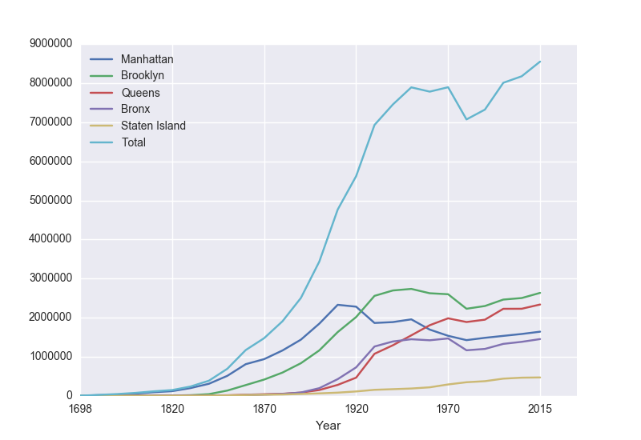
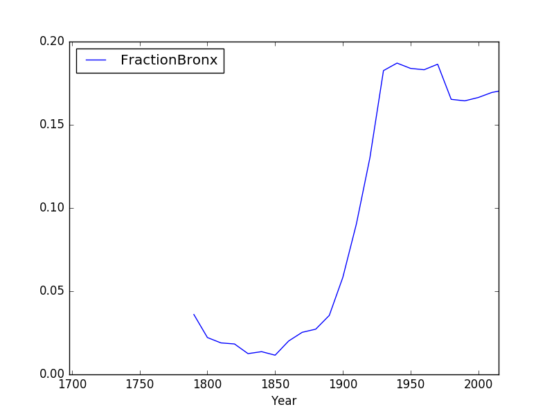

### [CSCI 127 &nbsp; Introduction to Computer Science](../127_2018_summer.html)  
Hunter College &nbsp; City University of New York 

---  
  	
LAB 6
---

Today's lab will focus on accessing formatted data using Pandas and Unix shell scripts.

Software tools needed: web browser and Python IDLE programming environment with the Pandas package installed.

### In-class Quiz

During lab, there is a [quiz](quizzes.html). The password to access the quiz will be given during lab. To complete the quiz, log on to Blackboard (see [Lab 1](lab1.html) for details on using Blackboard).

### Using Python, Gradescope, and Blackboard

See [Lab 1](lab_01.html) for details on using Python, Gradescope, and Blackboard.

### Pandas & Reading Data

To make reading files easier, we will use the Pandas library that lets you read in structured data files very efficiently. [Pandas](http://pandas.pydata.org), Python Data Analysis Library, is an elegant, open-source package for extracting, manipulating, and analyzing data, especially those stored in 2D arrays (like spreadsheets). It incorporates most of the Python constructs and libraries that we have seen thus far.

(Pandas is installed on all the lab machines. If you are using your own machine, see the directions at the end of [Lab 1](lab1.html) for installing packages for Python.)

In Pandas, the basic structure is a DataFrame which stored data in rectangular grids. Let's use this to visualize the change in New York City's population. First, start your file with an import statements for pyplot and pandas:

import matplotlib.pyplot as plt
import pandas as pd

We used matplotlib in the [Lab 3](lab3.html) and [Lab 4](lab4.html) for plotting. The as plt allows us to use the plotting commands without having to write matplotlib.pyplot everytime, instead we just write plt. Similarly, The as pd allows us to use pandas commands without writing out pandas everytime-- we just write pd.

Next, save the [NYC historical population data](../f17/nycHistPop.csv) to the same directory as your program. This is a "comma separated values" file-- which is a plain text file containging spreadsheet data, with commas separating the different columns (thus, the name). Here's the first 10 lines of the file:

Source:  https://en.wikipedia.org/wiki/Demographics\_of\_New\_York\_City,,,,,,
\* All population figures are consistent with present-day boundaries.,,,,,,
First census after the consolidation of the five boroughs,,,,,,
,,,,,,
,,,,,,
Year,Manhattan,Brooklyn,Queens,Bronx,Staten Island,Total
1698,4937,2017,,,727,7681
1771,21863,3623,,,2847,28423
1790,33131,4549,6159,1781,3827,49447
1800,60515,5740,6642,1755,4563,79215

Note that it has 5 extra lines at the top before the column names occur. The pandas function for reading in CSV files is read_csv(). It has an option to skip rows which we will use here:

pop = pd.read_csv('nycHistPop.csv',skiprows=5)

Before going on, let's print out the variable pop. pop is a dataframe, described in the reading above:

print(pop)

The last line of our first pandas program is:

pop.plot(x="Year")

which makes a graphical display of all of the data series in the variable pop with the series corresponding to the column "Year" as the x-axis. Your output should look something like:

To recap: our program is:

import matplotlib.pyplot as plt

import pandas as pd
pop = pd.read_csv('nycHistPop.csv',skiprows=5)
pop.plot(x="Year")

plt.show()

which did the following:

*   Imported the pandas library that contains structures and functions for organizing and visualizing data. We also imported the pyplot library which pandas uses to create figures.
*   It read in a CSV file, containing NYC population historical data.
*   It displayed the data as a visual plot of years versus borough populations.
*   The last line shows the figure you created in a separate graphics window.

There are useful built-in statistics functions for the dataframes in pandas. For example, if you would like to know the maximum value for the series "Bronx", you apply the max() function to that series:

print("The largest number living in the Bronx is", pop["Bronx"].max()) 

Similarly the average (mean) population for Queens can be computed:

print("The average number living in the Queens is", pop["Queens"].mean()) 

#### Challenges

*   What happens if you leave off the x = "Year"? Why?
*   What happens if you add in x = "Year", y = "Bronx"?
*   What does the series functions: .min(), .std(), and .count() do?

### Manipulating Columns

Each column in the original spreadsheet is a column, or series. We can look at the column for the Bronx with:

    print(pop['Bronx'])

How would you look at the one for Brooklyn?

A nice thing about series is that you can do basic arithmetic with them. For example,

    print(pop['Bronx']*2)

prints out double the values in the column.

You can also use multiple columns in a calculation:

    print(pop['Bronx']/pop['Total'])

prints out the fraction of the total population that lives in the Bronx.

We can save that series by creating a new column for it:

    pop['Fraction'] = pop['Bronx']/pop['Total']

and then can use it to create a new graph:

    pop.plot(x = 'Year', y = 'Fraction')

We can save it to a file, by storing the current figure (via "get current figure" or gcf() function and then saving it:

    fig = plt.gcf()
    fig.savefig('fractionBX.png')

shown in the following plot:

Putting this altogether, we have a program:

#Libraries for plotting and data processing:
import matplotlib.pyplot as plt
import pandas as pd

#Open the CSV file and store in pop
pop = pd.read_csv('nycHistPop.csv',skiprows=5)

#Compute the fraction of the population in the Bronx, and save as new column:
pop['Fraction'] = pop['Bronx']/pop['Total']

#Create a plot of year versus fraction of pop. in Bronx (with labels):
pop.plot(x = 'Year', y = 'Fraction')

#Save to the file:  fractionBX.png
fig = plt.gcf()
fig.savefig('fractionBX.png)

How can you modify the program to let the user specify the borough to compute the fraction of the population? When you have the answer, see the [Programming Problem List](ps.html).

### More on the Command Line Interface

You can write programs in the Unix shell scripting language. Often called _scripts_, they are typically used for tying together input and output from different programs.

Let's look at a sample script (from [elf lord's tutorials on linux](https://www.panix.com/~elflord/unix/bash-tute.html)):

#!/bin/bash
echo "hello, $USER. I wish to list some files of yours"
echo "listing files in the current directory, $PWD"
ls  # list files

Looking at this script line-by-line:

*   #!/bin/bash
    
    It's standard to include as the first line of your scripts that specifies the program that's running (this is often called the "shebang" line). There's different variants of shell scripts. We're using the default for Ubuntu (the type of Unix running on the lab laptops, called bash, so, we start our script by specifying that we want to use the bash shell to evaluate it.
    
*   The command echo is similar to print() in Python. It writes a message to the terminal:
    
    echo "hello, $USER. I wish to list some files of yours"
    echo "listing files in the current directory, $PWD"
    
    $USER is a built-in variable that store the name of the current user. Similarly, the built-in variable, $PWD, stores the current directory (folder) that you are in.
    
*   Lastly, our scripts can include any of the Unix commands that you have already learned. The last line of this file lists the files in the current directory using the ls command:
    
    ls  # list files
    

In the shell, the different types of quotes have similar, but different, [meanings](https://www.gnu.org/software/bash/manual/html_node/Double-Quotes.html). We'll use the double quotes since strings in double quotes will have special characters (like \\n for newline) interpreted as in Python and C++.

Use gEdit (you can launch it from the menu bar or by typing gedit at a terminal window) to modify the above script to say "Hello, World". We're leaving off the "!" since it is a bit confusing to print due to its special meaning in the shell (it lists the history, or previous commands, you have typed-- !! gives all commands in the history, !cd will repeat the most recent command you gave that starts with cd).

Next, we'll change the permissions on the file, so that we can run it directly, by just typing its name:

chmod +x helloScript

(changes the "mode" of the file helloScript to be executable-- if you name it something else, replace the name in chmod command above).*   To run your first shell script, you can now type its name at the terminal:
    
    ./helloScript
    
    Make sure to include a comment on the **second line** with your name (the first line has the #! line). Comments in shell are, like Python, preceded by a #.
    
    Once you have a shell script that will print Hello, World, see the [Programming Problem List](ps.html).
    

### What's Next?

If you finish the lab early, now is a great time to get a head start on the programming problems due early next week. There's instructors to help you, and you already have Python up and running. The [Programming Problem List](ps.html) has problem descriptions, suggested reading, and due dates next to each problem.
